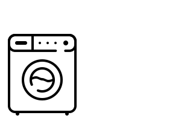

# Washer Notifier

Not intrusive way to receive notifications when the washer finishes using NodeMCU ESP8266 module and Arduino IDE.

## Washer Notifier for Webhooks

Receive a notification in your Webhook when the Washer finishes. [More info](docs/_1_WasherNotifier_Webhook/readme.md).