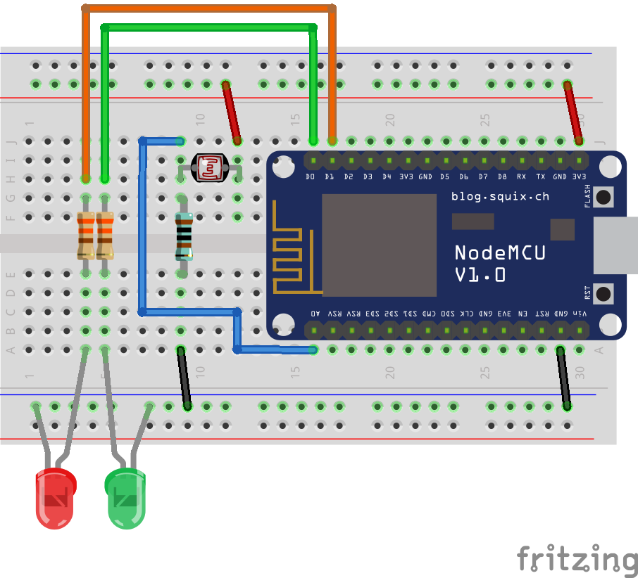

# Washer Notifier for Webhooks

Receive a notification in your Webhook when the Washer finishes.

## Protoboard

You could download the **Fritzing** proyect [here](_1_WasherNotifier_Webhook.fzz).

## Materials

- 1x NodeMCU ESP8266 Module
- 1x 1K Resistor
- 2x 330Ohm Resistor
- 1x LDR Photoresistor
- 1x Red led
- 1x Green led

> If you want to use another *ESP8266* module, note that **LDR Photoresistor** is an *Analog sensor* and not all the *ESP8266* modules have this input available. You could use a *Digital Photoresistor* like **LM393** to avoid this issue.

## Instalation

Connect **NodeMCU** to your computer using **microUSB**, and deploy the [following code](../../src/_1_WasherNotifier_Webhook/) using **Arduino IDE** and modifying the `const` in the code with your current info.

## How to use

- **Red led** blinks when loading.
- **Red led** permanently on indicates an error. Connect your *NodeMCU* to a computer and check the *Monitor Serie* log to debug.
- **Photoresistor** must be placed over the *washer END notification led*, therefore, the *LED* of the washing machine will be covered and it will be necessary the
- **Green led**, that is synchronized with the *washer END notification led* to show the user when the washer ends.